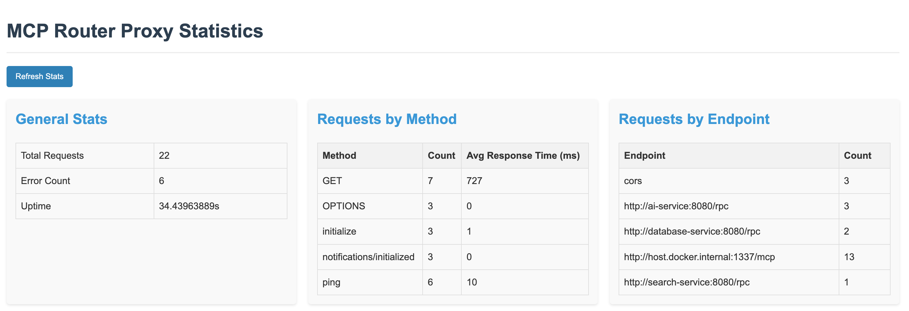

# MCP Catie - Context Aware Traffic Ingress Engine

A lightweight, configurable proxy service for routing MCP (Model Context Protocol) JSON-RPC requests to appropriate backend services based on request content.

> **Note:** This project is currently in alpha status.

## Features

- Dynamic routing of MCP JSON-RPC requests based on method and parameters
- Pattern-based routing using regular expressions
- Session-aware routing to maintain client connections to the same backend
- Support for Streamable HTTP transport with SSE (Server-Sent Events)
- Hot-reloading of configuration without service restart
- Graceful shutdown handling
- Health check endpoint for monitoring
- Prometheus metrics integration for observability
- Structured logging
- Containerized deployment with Docker
- Basic authentication for monitoring UI

## Architecture

The application is structured into several packages:

- `cmd/main.go` - Application entry point with server setup
- `pkg/config` - Configuration loading and management
- `pkg/router` - Request routing and proxy logic
- `pkg/session` - Session management for maintaining client connections
- `pkg/logger` - Structured logging system
- `pkg/ui` - Simple web UI for monitoring

## Configuration

The router is configured using a YAML file (`router_config.yaml`). Here's an example configuration:

```yaml
resources:
  "^weather/.*": "http://weather-service:8080/mcp"
  "^database/.*": "http://database-service:8080/mcp"
tools:
  "^calculator$": "http://calculator-service:8080/mcp"
  "^translator$": "http://translator-service:8080/mcp"
default: "http://default-service:8080/mcp"
ui:
  username: "admin"
  password: "your_secure_password"
```

The configuration consists of:

- `resources`: Regex patterns for resource URIs and their target endpoints
- `tools`: Regex patterns for tool names and their target endpoints
- `default`: Fallback endpoint for requests that don't match any pattern
- `ui`: Authentication credentials for the monitoring UI

The configuration file is automatically reloaded when changes are detected.

## Installation

### Prerequisites

- Go 1.18 or higher
- Docker (optional, for containerized deployment)

### Building from Source

1. Clone the repository:
   ```bash
   git clone https://github.com/mclenhard/mcp-router-proxy.git
   cd mcp-router-proxy
   ```

2. Build the application:
   ```bash
   go build -o mcp-router-proxy ./cmd/main.go
   ```

3. Edit router_config.yaml to match your environment

4. Run the application:
   ```bash
   ./mcp-router-proxy
   ```

### Using Docker

1. Build the Docker image:
   ```bash
   docker build -t mcp-router-proxy .
   ```

2. Run the container:
   ```bash
   docker run -p 80:80 -v $(pwd)/router_config.yaml:/root/router_config.yaml mcp-router-proxy
   ```

## Usage

The proxy listens for MCP requests on the `/mcp` endpoint. Requests are routed based on their method and parameters:

- `resources/read` requests are routed based on the `uri` parameter
- `tools/call` requests are routed based on the `name` parameter
- Other requests are sent to the default endpoint

The proxy supports both GET and POST methods according to the MCP Streamable HTTP transport specification:

- POST requests are used to send JSON-RPC messages to the server
- GET requests are used to establish SSE streams for server-to-client communication

### Session Management

The proxy maintains session state by tracking the `Mcp-Session-Id` header. When a client establishes a session with an MCP server through the proxy, subsequent requests with the same session ID are routed to the same backend server.

### Health Check

A health check endpoint is available at `/health` which returns a 200 OK response when the service is running.

### Monitoring

A simple monitoring UI is available at `/stats` which shows request statistics and routing information. This interface is protected by basic authentication using the credentials specified in the configuration file.



### Prometheus Integration

The service exposes Prometheus-compatible metrics at the `/metrics` endpoint. These metrics include:

- `mcp_router_requests_total`: Total number of requests processed
- `mcp_router_errors_total`: Total number of request errors
- `mcp_router_requests_by_method`: Number of requests broken down by method
- `mcp_router_requests_by_endpoint`: Number of requests broken down by target endpoint
- `mcp_router_response_time_ms`: Average response time in milliseconds by method
- `mcp_router_uptime_seconds`: Time since the router started in seconds

You can configure Prometheus to scrape these metrics by adding the following to your Prometheus configuration:

```yaml
scrape_configs:
  - job_name: 'mcp-router'
    scrape_interval: 15s
    static_configs:
      - targets: ['your-router-host:80']
```

This endpoint is also protected by the same basic authentication as the stats UI.

## Development

### Project Structure

```
mcp-router-proxy/
├── cmd/
│   └── main.go
├── pkg/
│   ├── config/
│   │   └── config.go
│   ├── router/
│   │   └── router.go
│   ├── session/
│   │   └── store.go
│   ├── logger/
│   │   └── logger.go
│   └── ui/
│       └── ui.go
├── Dockerfile
├── go.mod
├── go.sum
├── README.md
└── router_config.yaml
```

### Adding New Features

1. Fork the repository
2. Create a feature branch
3. Add your changes
4. Submit a pull request

## Roadmap

The following features are planned for upcoming releases:
- ~~**Add SSE Support**: Add support for SSE (Server-Sent Events) to the proxy~~
- **Complete Message Forwarding**: Ensure all MCP message types (including roots and sampling) are properly forwarded without interference
- **Intelligent Caching**: Response caching with configurable TTL, cache invalidation, and support for memory and Redis backends
- **Rate Limiting**: Configurable rate limiting with multiple strategies, response headers, and distributed rate limiting support
- **Circuit Breaking**: Automatic detection of backend failures with fallback responses
- **Request Transformation**: Modify requests before forwarding to backends
- **Response Transformation**: Transform backend responses before returning to clients

Development priorities are based on community feedback. Please open an issue to request features or contribute to the roadmap discussion.

## License

[MIT License](LICENSE)

## Contributing

Contributions are welcome! Please feel free to submit a Pull Request.

## Support

For support, please open an issue in the GitHub repository or contact me at [mclenhard@gmail.com](mailto:mclenhard@gmail.com).